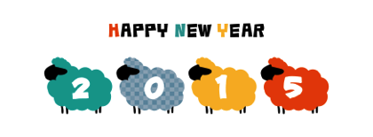
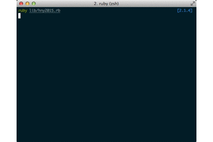

# Happy New Year 2015 - New Year's Greetings From ROOTER,Inc.

New Year's Greetings From ROOTER,Inc.  
Sheep jumping may help you sleep well.

Enjoy!

## Demo

## Requirements
- **Ruby**: 2.1.4+
(It may work under lower ruby versions, but there is no guarantee for them.)

## Quick Play
For those who are in a hurry, just try this.

    git clone git@github.com:rooter-inc/hny2015
    ruby hny2015/lib/sample.rb

Easy!

## How it work
### install
Add this to your gem file:

    gem 'hny2015', github: 'rooter-inc/hny2015'

then run

    bundle install

### usage

    require "hny2015"

    hny = HNY2015.new
    hny.play

Or you can see these parts separately:

    hny.message   # show message
    hny.animation # show sheep animation

